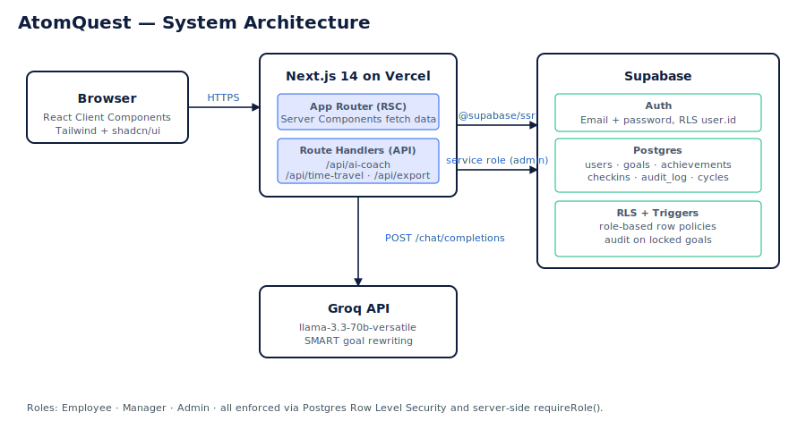

# AtomQuest — Goal Setting & Tracking Portal

End-to-end annual goal lifecycle: creation → manager approval → quarterly check-ins → reporting → audit. Built for the AtomQuest Hackathon 1.0.

**Live demo:** _add your Vercel URL here_

---

## Three differentiators

1. **AI Goal Coach** — one click rewrites a vague goal into a SMART goal (title, description, UoM, target, rationale, score). Powered by **Groq Llama 3.3 70B** via `/api/ai-coach`.
2. **Time-Travel demo mode** — admin can jump the system clock to any quarter from `/admin/cycles`. The whole app behaves as if that's today, driven by `cycles.simulated_date`.
3. **Live Weightage Validator** — animated bar that turns green at exactly 100%, red otherwise, with live deltas.

## Tech stack

| Layer | Choice |
|---|---|
| Framework | Next.js 14 (App Router, RSC, TypeScript) |
| UI | Tailwind CSS + shadcn-style primitives (Radix UI) |
| Database | Supabase Postgres + Row Level Security + Triggers |
| Auth | Supabase Auth (`@supabase/ssr`) |
| AI | Groq API (`llama-3.3-70b-versatile`) |
| Forms | react-hook-form + zod |
| Charts | Recharts |

## Cost (500 users)

| Service | Tier | Monthly |
|---|---|---|
| Vercel | Hobby | $0 |
| Supabase | Free tier | $0 |
| Groq | Pay-as-you-go (~$0.59 / 1M tokens) | ~$5–15 |
| **Total** | | **~$15/mo** |

## Demo credentials (password: `Atom@123`)

| Role | Email | Notes |
|---|---|---|
| Admin | admin@atomquest.com | Aarav Admin · HR |
| Manager | priya.manager@atomquest.com | Priya Sharma · Engineering |
| Manager | ravi.manager@atomquest.com | Ravi Iyer · Sales |
| Employee | arjun.emp@atomquest.com | reports to Priya |
| Employee | sneha.emp@atomquest.com | reports to Priya |
| Employee | karan.emp@atomquest.com | reports to Ravi |
| Employee | meera.emp@atomquest.com | reports to Ravi |

Or use the [`/demo`](http://localhost:3000/demo) launcher.

## Local setup

```bash
npm install
cp .env.local.example .env.local   # fill in the four keys
npm run dev
```

Required env vars:
- `NEXT_PUBLIC_SUPABASE_URL`
- `NEXT_PUBLIC_SUPABASE_ANON_KEY`
- `SUPABASE_SERVICE_ROLE_KEY`
- `GROQ_API_KEY`

### Supabase setup (one-time)

1. Open Supabase SQL Editor → paste & run `supabase/schema.sql`.
2. Authentication → Users → Add User (with password `Atom@123`) for the 7 emails above.
3. Copy each UUID into `supabase/seed.sql` (uncomment the user `INSERT`).
4. Run `supabase/seed.sql` in the SQL Editor.

## Features

- ✅ Phase 1: Project setup, Tailwind, Inter, brand colors
- ✅ Phase 2: Folder structure, atom logo
- ✅ Phase 3: schema, seed, UoM engine, cycle clock, AI coach
- ✅ Phase 4: Supabase SSR clients, auth guards, middleware, login, role layouts
- ✅ Phase 5: Employee goal sheet, **WeightageBar**, **AI Coach button**, goal form
- ✅ Phase 6: Manager approvals (inline-edit, approve all, return for rework), team dashboard, per-employee check-in
- ✅ Phase 7: Employee quarterly check-in with live score preview
- ✅ Phase 8: Admin cycles + **Time-Travel panel**, users directory, **vertical audit timeline**
- ✅ Phase 9: Completion dashboard (Recharts bar chart) + CSV export
- ✅ Phase 10: Landing, demo launcher, error boundary, notifications bell, architecture SVG

## Architecture



---

Built with care for the AtomQuest Hackathon 1.0.
