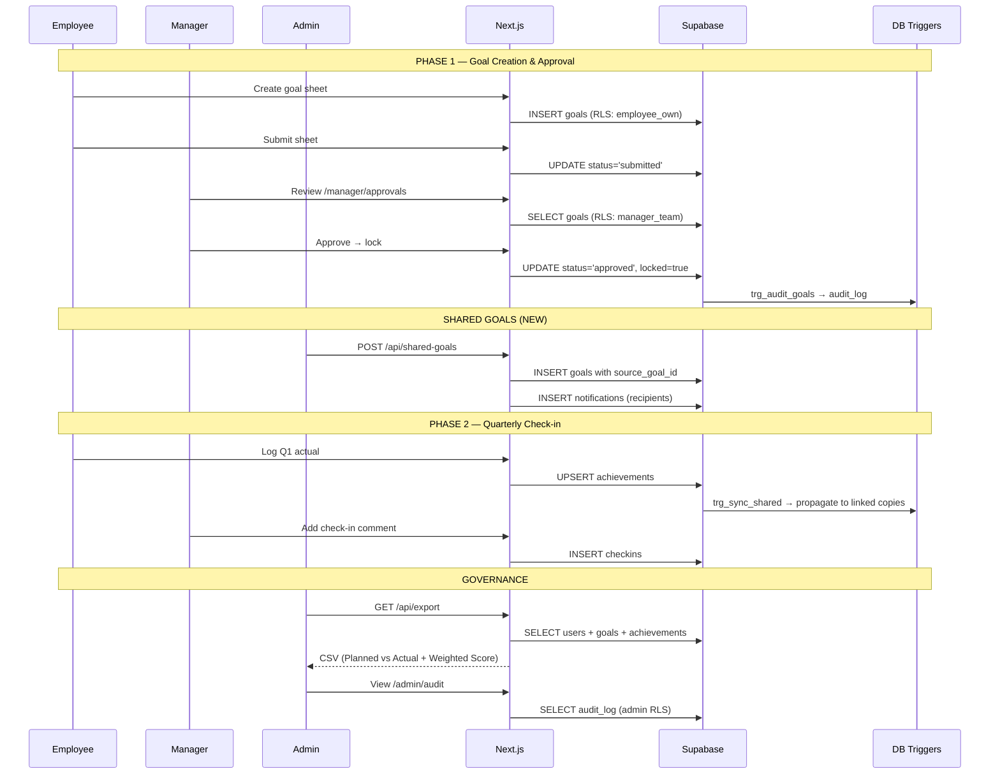

# Aimsync — Architecture Diagram

> Atomberg AtomQuest Hackathon 1.0 — In-House Goal Setting & Tracking Portal

## High-level architecture (Mermaid)

```mermaid
flowchart TB
    subgraph Client["🖥️ Browser (Employee · Manager · Admin)"]
        UI["Next.js 14 App Router<br/>React Server + Client Components<br/>Tailwind · Radix UI · Recharts"]
    end

    subgraph Edge["▲ Vercel Edge"]
        MW["middleware.ts<br/>Auth cookie refresh<br/>Route protection"]
    end

    subgraph App["▲ Vercel — Next.js Runtime"]
        direction TB
        RSC["Server Components<br/>(page.tsx · layout.tsx)<br/>requireRole() guards"]
        API["Route Handlers<br/>/api/shared-goals<br/>/api/export · /api/ai-coach<br/>/api/time-travel"]
        LIB["lib/<br/>uom-engine · cycle-clock<br/>audit · auth-guard"]
    end

    subgraph Supabase["🟢 Supabase (Postgres + Auth)"]
        direction TB
        AUTH["Auth<br/>Email/Password · JWT"]
        DB[("Postgres<br/>users · cycles · goals<br/>achievements · checkins<br/>audit_log · notifications<br/>thrust_areas")]
        RLS["Row-Level Security<br/>employee_own · manager_team<br/>admin_all"]
        TRIG["Triggers<br/>• log_goal_change (audit)<br/>• sync_shared_achievement"]
    end

    subgraph External["🌐 External"]
        AI["Anthropic Claude API<br/>(AI Goal Coach)"]
    end

    Client -->|HTTPS| MW
    MW --> RSC
    Client -->|fetch| API
    RSC -->|@supabase/ssr<br/>cookie session| AUTH
    RSC --> LIB
    API --> LIB
    API -->|service role<br/>(bypass RLS)| DB
    RSC -->|anon key<br/>(RLS enforced)| DB
    AUTH --- DB
    DB --- RLS
    DB --- TRIG
    API -->|prompts| AI

    classDef supa fill:#3ecf8e22,stroke:#3ecf8e,color:#000
    classDef next fill:#00000011,stroke:#000,color:#000
    classDef ext fill:#f5a62311,stroke:#f5a623,color:#000
    class Supabase,AUTH,DB,RLS,TRIG supa
    class App,RSC,API,LIB,Edge,MW next
    class External,AI ext
```

## Request flow — three role journeys



## Component → data dependency map

```mermaid
flowchart LR
    subgraph Pages["App routes"]
        EG[/employee/goals/]
        EC[/employee/checkin/]
        MA[/manager/approvals/]
        MC[/manager/checkin/[id]/]
        AC[/admin/cycles/]
        AS[/admin/shared-goals/]
        AU[/admin/users/]
        AA[/admin/audit/]
        AR[/admin/reports/]
    end

    subgraph Tables["Postgres tables"]
        T1[users]
        T2[cycles]
        T3[goals]
        T4[achievements]
        T5[checkins]
        T6[audit_log]
        T7[notifications]
        T8[thrust_areas]
    end

    EG --> T3 & T8 & T2
    EC --> T3 & T4 & T2
    MA --> T3 & T1
    MC --> T3 & T4 & T5
    AC --> T2
    AS --> T3 & T1
    AU --> T1
    AA --> T6
    AR --> T1 & T3 & T4
```

## Stack & hosting choices

| Layer | Choice | Why |
|---|---|---|
| **Framework** | Next.js 14 (App Router) | RSC = fewer client bundles → lower egress · server-only DB reads keep keys safe |
| **UI** | Tailwind + Radix UI + Lucide + Recharts | Accessible primitives, zero runtime CSS, tree-shakeable |
| **DB / Auth** | Supabase (Postgres + Auth) | Single managed service · RLS pushes authz into DB (no extra API tier) · free tier covers demo |
| **Edge / Middleware** | Vercel Edge | Cookie refresh runs at the edge — sub-50ms auth checks |
| **AI** | Anthropic Claude (server-side) | Server-only call · key never reaches the browser |
| **Hosting** | Vercel + Supabase free tiers | Zero idle cost · serverless functions billed per-invocation |

## Cost-optimisation notes

- **RLS over a custom API layer** — most queries hit Postgres directly from RSC with the anon key; only privileged operations (`/api/shared-goals`, `/api/export`) use the service role. This eliminates a whole middle tier of compute.
- **Server Components everywhere possible** — dashboards, reports and lists are fetched on the server, so the client bundle stays small and Vercel charges nothing for hydration data we never send.
- **DB triggers for cross-cutting concerns** — audit logging (`trg_audit_goals`) and shared-goal sync (`trg_sync_shared`) run in the database. No app-tier polling, no extra round-trips, no missed events.
- **Per-cycle indexes** — `idx_goals_employee_cycle` and `idx_goals_source` keep the hot queries (employee goal-sheet, shared-goal lookup) on cheap index scans.
- **CSV streamed in one round-trip** — `/api/export` issues exactly three queries (users · goals · achievements) and zips them in JS, instead of N+1 per employee.
